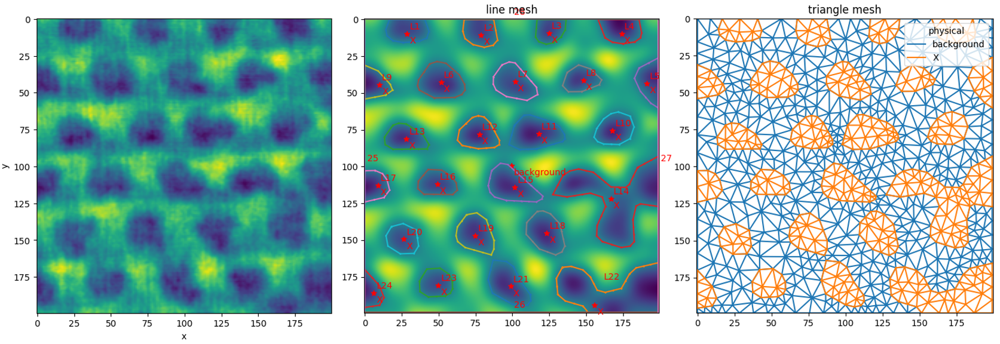
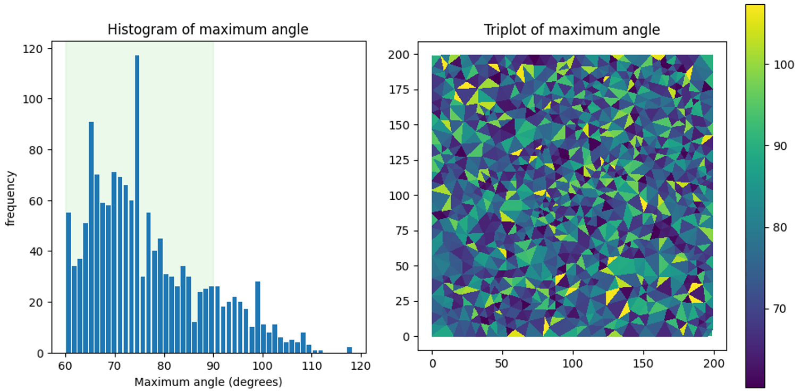
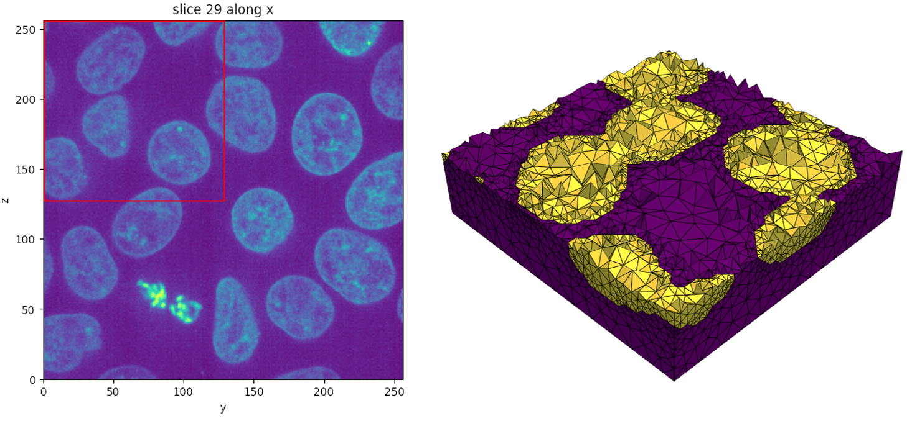

# Summary

`Nanomesh` is a Python library that allows users to quickly and easily create 2D and 3D meshes directly from images of the object they wish to mesh. The automated workflow can preprocess and segment the picture to extract different regions and create conforming meshes of the objects. Analysis tools allow evaluating the quality of the resuting mesh and the detection of problematic regions. The resulting meshes can be exported to a variety of popular formats so that they can be used in finite element simulations. `Nanomesh` can be used as python library for example in Jupyter notebooks, or through dedicated online dashboards.

# Statement of need

Simulations based on finite element methods (FEM) often require the creation of a unstructured mesh that represents the topology and physical properties of the object under examination. Many meshing libraries exist and allow the creation of such meshes. Several of these are proprietary with sometimes a substantial fee due to the level of certification required by their application domains [@centaur; @scanip]. Some open source libraries do exist but often create meshes from a CAD design or well defined primitive [@gmsh; @cgal]. While these meshing libraries are invaluably useful for the study of idealized systems they do not allow the mesh to account for potential defects in the underlying topology of the object.

For example, the calculation of the optical properties of nanocrystals is usually performed with an ideal nano-structure as substrate for the propagation of the Maxwell equations [@Koenderink2005; @Hughes2005]. Such simulations provide very valuable insight but ignore the effect that manufacturing imprecision of the nanometer-sized pores can have on the overall properties of the crystal. To resolve such structure-property relationship, meshes conforming to experimental images of real nanocrystals are needed. The subsequent simulation of wave propagation through these meshes using any FEM solver leads to a better understanding of the impact that imperfections may have on the overall properties. Similar use cases in different fields of material science and beyond are expected. The direct FEM simulations on real device topology might bring very valuable insights. Through its user friendliness, code qualitiy, `nanomesh` will enable scientist running advanced simulations on meshes that accurately represent the devices that are manufactured experimentally.

# Workflow and class hierarchy

A large part of the work of generating a mesh is to pre-process, filter, and segment the image data to generate a contour that accurately describes the objects of interest.

\autoref{fig:flowchart} shows the `Nanomesh` workflow from left to right. The input data are read from a 2D or 3D `numpy` array [@numpy] into an `Image` object. `Nanomesh` has dedicated classes (`Mesher`s) to generate contours and triangulate or tetrahedralize the image data.

Meshes are stored in `MeshContainer`s; this is an overarching data class that contains a single set of coordinates with multiple cell types. This is useful for storing the output from triangulation as well as the contour obtained after segmentation and the object boundaries. Dedicated `Mesh` types contain methods to work with the underlying data structure directly.


# Example

To illustrate how to use `Nanomesh`, we present an example to create 2D and 3D meshes of nanopores etched in a silicon matrix. These nanopores are very often used in the creation of optical crystals and the study of their properties is therefore crucial.

`Nanomesh` works with `numpy` arrays. The following snippet uses some sample data included with `Nanomesh` and loads it into an `Image` object. \autoref{fig:mesh_plots} shows the input image as output by the snippet below.

```python
from nanomesh import Image, data

image_array = data.nanopores()
plane = Image(image_array)
plane.show()
```

## Filter and segment the data

Image segmentation is a way to label the pixels of different regions of interest in an image. In this example, we are interested in separating the silicon bulk material (bright) from the nanopores (dark).

Common filters and image operations like Gaussian filter are available as a method on the `Image` object directly. `Nanomesh` uses `scikit-image` [@skimage] for image operations. Other image operations can be applied using the `.apply()` method, which guarantees an object of the same type will be returned. For example, the code below is essentially short-hand for `plane_gauss = plane.apply(skimage.filters.gaussian, sigma=5)`.

```python
plane_gauss = plane.gaussian(sigma=5)
```

The next step is to segment the image using a threshold method. In this case, we use the `li` algorithm [@Li1993], because it appears to give good separation.

```python
thresh = plane_gauss.threshold('li')
segmented = plane_gauss.digitize(bins=[thresh])
```



## Generate mesh

Meshes are generated using the `Mesher` class. Meshing consists of two steps: contour finding and triangulation. Contour finding uses the marching cubes algorithm implemented in `scikit-image` [@skimage] to wrap all the pores in a polygon. `max_edge_dist=5` redefines straight edges to have points no more than 5 pixels apart. Sometimes an edge is defined by (too) many points, which can result in unnessecarily fine meshes, because the meshing algorithm will not remove these points. `level` specifies the level at which the contour is generated. Here, we set it to the threshold value determined above. The code below creates the contour around the features in the gaussian filtered image.

```python
from nanomesh import Mesher

mesher = Mesher(plane_gauss)
mesher.generate_contour(max_edge_dist=5, level=thresh)
mesher.plot_contour()
```

\autoref{fig:mesh_plots} shows the output of `mesh.plot_contour()`, a comparison of the gaussian filtered image with the contours.

The contours are used as a starting point for triangulation. The triangulation itself is performed by the `triangle` library [@triangle]. Options can be specified through the `opts` keyword argument. This example uses `q30` to generate a quality mesh with angles > 30°, and `a100` to set a maximum triangle size of 100 pixels.

```python
mesh = mesher.triangulate(opts='q30a100')
```

Triangulation returns a `MeshContainer` dataclass that can be used for various operations, for example comparing it with the original image:

```python
plane.compare_with_mesh(mesh)
```

## Metrics

`Nanomesh` contains a metrics module, which can calculate several common mesh quality indicators, such as the minimum/maximum angle distributions, ratio of radii, shape paramaters, area, et cetera. The snippet below illustrates how such plots can be generated (\autoref{fig:mesh_metrics}).

```python
from nanomesh import metrics

triangle_mesh = mesh.get('triangle')
metrics.histogram(triangle_mesh, metric='max_angle')
metrics.plot2d(triangle_mesh, metric='max_angle')
```

{ width=70% }

## Exporting the data

Data can be exported to various formats. This uses `meshio` [@meshio], a library for reading, writing and converting between unstructured mesh formats.

```python
mesh.write('out.msh', file_format='gmsh22', binary=False)
```

# 3D volumes

The workflow for 3D data volumes is similar, although the underlying implementation is different. Instead of a line mesh, a 3D (triangle) surface mesh wraps the segmented volume. Tetrahedralization is performed using `tetgen` [@tetgen] as the underlying library. \autoref{fig:mesh3d} shows an example of 3D cell data, which were meshed using `Nanomesh` and vizualized using `PyVista` [@pyvista].

{ width=70% }


# Acknowledgements

We acknowledge contributions from Jaap van der Vegt, Matthias Schlottbom and Willem Vos for scientific input and helpful discussions guiding the development of Nanomesh.

# References
